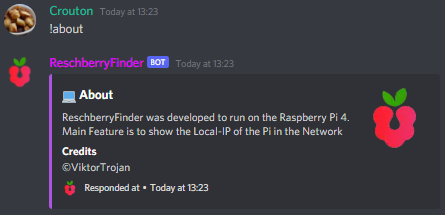

# ReschberryFinder Made With 
> A Discord-Bot that helps you to find your Raspberry Pi 4

## Description

ReschberryFinder is a Discord-Bot made with Discord.js developed to run on a Raspberry Pi 4. A Raspberry is mostly accessed via Remote Connection(SSH) and therefore you need the IP-Address of it. ReschberryFinder shows you all IP-Addresses which can be useful when hostnames are disabled in a Network.

## ShowCase

     

     
 

## How it Works
It uses Discord.js to work with Discord. By using the Command **!WhatsMyIp** the Pi returns all IP's of the various Interfaces.

## Commands
* **!Help** ``(Shows all the Available Commands in all Categories)``
* **!About** ``(Short description of the Bot)``
* **!WhatsMyIp** ``(Shows all the IP-Addresses of the various Interfaces)``
* **!Ping** ``(Shows the Ping response. More of a Testing command)``

## Features
* **Command System** ``(To manage all Commands)``
* **Event System** ``(To Manage all Discord Events)``
* **Network Util** ``(To get the various Interfaces and IP's)``

## Getting Started

### Requirements

* Windows, Linux Distribution
* Node.js
* Discord.js
* enmap
* Discord Bot Token

### ❗Don't forget to change the DiscordBot Token in src/config.json❗

### Installing

* [Node.js](https://nodejs.org/) v.17
* **npm install** ``(run in the Project directory to install all necessary packages)``

### Executing program

* **npm run start** ``(run in the Project directory to start the Bot)``

### Auto-Startup For Linux with Crontab
* $ crontab -e
* @reboot npm start --prefix <location>/ReschberryFinder
> change <location> with the Directory Path to the Project(e.g /home/pi/Documents)

## Help

On unexpected behaviour open an Issues Ticket

## Authors

People contributed to this Project

[@ViktorTrojan](https://github.com/ViktorTrojan)

## Version History
 See all Releases on [Releases Page](https://github.com/ViktorTrojan/ReschberryFinder/releases)
 
 * 2.0 ReschberryFinder Release
    * Added Status for my class lessons
    * Renamed Project
     
 * 1.0 Minimal Release
    * Initial Release with minimal functionality
